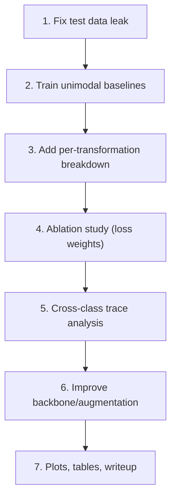

# Areas of Improvement: Current Model vs. Project Requirements

## Summary

The current [computer_vision_project.py](file:///home/anoojs/Documents/cv-project/computer_vision_project.py) is a **solid baseline** — it has working data loading, multi-task model architecture, training loop, and basic evaluation. However, it only covers about **40–50%** of what the [project PDF](file:///home/anoojs/Documents/cv-project/CV-project.pdf) requires. Below is a systematic breakdown.

---

## Status Overview

| Project Requirement | Status | Notes |
|---|---|---|
| Data preparation & subset selection | ✅ Done | Balanced subset, stratified split |
| Multi-task unified model | ✅ Done | Shared ResNet18 backbone + 2 heads |
| Joint training with weighted loss | ⚠️ Partial | Only `w1=0.5, w2=0.5` tested, no ablation |
| Unimodal baselines | ❌ Missing | Never trained single-task models for comparison |
| Joint vs. unimodal comparison | ❌ Missing | Required by project |
| Per-transformation accuracy breakdown | ❌ Missing | Critical analysis requirement |
| Ablation study (loss weighting) | ❌ Missing | Explicitly required |
| Cross-class transformation traces | ❌ Missing | Analytical phase |
| Hardware/subset choice documentation | ❌ Missing | Required in writeup |
| Stronger backbone / training techniques | ⚠️ Opportunity | ResNet18 is minimal |

---

## 1. Unimodal Baselines (❌ Missing — Required)

> *"Compare against the unimodal baselines to assess whether joint training improves, degrades, or leaves unchanged the performance of each individual task."*

**What's needed:**
- Train **two separate single-task models**:
  - **Model A**: Same ResNet18 backbone, trained *only* on real/fake (binary classification)
  - **Model B**: Same ResNet18 backbone, trained *only* on transformation type (3-class)
- Record their val accuracy/F1 independently
- Compare those numbers against the joint multi-task model

**Why it matters:** This is the core scientific question of the project — does multi-task learning help, hurt, or make no difference? Without baselines, the joint model results are uninterpretable.

---

## 2. Per-Transformation Accuracy Breakdown (❌ Missing — Required)

> *"Break down real/fake detection accuracy separately for each transformation category — original, transmitted, and re-digitized — to identify which post-processing operations are most damaging to detection performance."*

**What's needed:**
- During evaluation, compute real/fake accuracy **grouped by transformation type**:

  | Transform Type | Real/Fake Accuracy | Real Acc | Fake Acc |
  |---|---|---|---|
  | Original | ? | ? | ? |
  | Transmitted | ? | ? | ? |
  | Redigitalized | ? | ? | ? |

- This reveals, for example, whether the detector breaks down specifically on transmitted images
- Also check whether **real images** and **AI images** respond differently to the same post-processing (cross-class traces)

**Current gap:** The existing `evaluate_multitask_performance()` ([L650–L697](file:///home/anoojs/Documents/cv-project/computer_vision_project.py#L650-L697)) computes global confusion matrices but never slices by transformation category.

---

## 3. Ablation Study: Loss Weighting (❌ Missing — Required)

> *"Analyze how different weightings of the two task losses affect the trade-off between real/fake accuracy and transformation classification accuracy."*

**What's needed:**
- Currently hardcoded as `w1, w2 = 0.5, 0.5` at [L253](file:///home/anoojs/Documents/cv-project/computer_vision_project.py#L253)
- Must systematically try several weight combinations, e.g.:

  | Config | w1 (binary) | w2 (transform) |
  |---|---|---|
  | A | 1.0 | 0.0 |
  | B | 0.75 | 0.25 |
  | C | 0.5 | 0.5 |
  | D | 0.25 | 0.75 |
  | E | 0.0 | 1.0 |

- For each, record val accuracy for **both** tasks
- Plot the **Pareto frontier** showing the accuracy trade-off
- Determine whether the tasks compete for representational capacity or complement each other

---

## 4. Cross-Class Transformation Traces (❌ Missing — Required)

> *"Investigate whether AI-generated and real images respond differently to the same post-processing operations, potentially revealing exploitable cross-class traces."*

**What's needed:**
- Analyze the **6-class confusion matrix** (2 binary × 3 transform)
- For each transformation type, compare how the model's binary prediction confidence/accuracy changes between real and AI images
- Look for patterns like: "transmitted real images are often misclassified as fake, but transmitted AI images are correctly identified" — this would be a cross-class trace
- Visualize with grouped bar charts or heatmaps

---

## 5. Model Architecture & Training Improvements (⚠️ Opportunity)

These aren't strictly *required* by the PDF but would significantly improve your results:

### Architecture
- **Backbone**: ResNet18 ([L215](file:///home/anoojs/Documents/cv-project/computer_vision_project.py#L215)) is the lightest option. Consider:
  - **ResNet50** — much stronger features, still fast
  - **EfficientNet-B0/B3** — better accuracy/compute trade-off
  - **ConvNeXt-Tiny** — modern architecture with strong performance
- **Task heads**: Currently single `nn.Linear` layers ([L224–L227](file:///home/anoojs/Documents/cv-project/computer_vision_project.py#L224-L227)). Adding dropout + hidden layer could help:
  ```python
  self.binary_head = nn.Sequential(
      nn.Dropout(0.3),
      nn.Linear(num_features, 256),
      nn.ReLU(),
      nn.Linear(256, 2)
  )
  ```

### Data Augmentation
- Currently only `RandomHorizontalFlip` ([L188](file:///home/anoojs/Documents/cv-project/computer_vision_project.py#L188))
- Consider adding:
  - `RandomResizedCrop` instead of plain `Resize`
  - `ColorJitter` (brightness, contrast, saturation)
  - `RandomRotation`
  - `RandomErasing`
  - Or use `torchvision.transforms.v2.AutoAugment`

### Training
- **No learning rate scheduler** — add `CosineAnnealingLR` or `ReduceLROnPlateau`
- **No early stopping** — model may overfit across 10 epochs
- **No best-model checkpointing** — you should save the model with best val accuracy
- **No gradient clipping** — helps stability

### Evaluation
- The current code reports only **accuracy** — add **F1-score, precision, recall** per class (the project implicitly expects thorough metrics)
- Track training/validation loss curves over epochs for a proper training analysis plot

---

## 6. Code Structure Issues (⚠️ Minor)

- **Double training**: The script trains the model twice — once at [L322–L336](file:///home/anoojs/Documents/cv-project/computer_vision_project.py#L322-L336) (first pass with incomplete data) and again at [L628–L642](file:///home/anoojs/Documents/cv-project/computer_vision_project.py#L628-L642) (after downloading test data). The first training is redundant in the final pipeline.
- **Test data used for training**: The second pass re-scans the *entire* data directory including `test_subset` ([L531](file:///home/anoojs/Documents/cv-project/computer_vision_project.py#L531)), which means test data leaks into training. This must be fixed — test data should only be used for final evaluation.
- **No model saving**: After training, the model is not saved to disk (`torch.save`). If the script crashes during evaluation, all training is lost.

---

## Priority Roadmap

Based on what the project PDF explicitly requires, here's the recommended order:



| Priority | Task | Effort |
|---|---|---|
| 🔴 P0 | Fix test data leak into training | Small |
| 🔴 P0 | Unimodal baselines (2 models) | Medium |
| 🔴 P0 | Per-transformation accuracy breakdown | Small |
| 🟡 P1 | Ablation study (5 weight configs) | Medium |
| 🟡 P1 | Cross-class transformation analysis | Medium |
| 🟢 P2 | Stronger backbone (ResNet50/EfficientNet) | Small |
| 🟢 P2 | Better augmentation pipeline | Small |
| 🟢 P2 | LR scheduler + early stopping + checkpointing | Small |
| 🟢 P2 | Training curves / visualization | Small |

> [!CAUTION]
> **Test data leak**: The current code merges `test_subset` images into the metadata scan at [L531–L581](file:///home/anoojs/Documents/cv-project/computer_vision_project.py#L531-L581), then resamples training data from the entire pool at [L589–L605](file:///home/anoojs/Documents/cv-project/computer_vision_project.py#L589-L605). This means test images may end up in the training set. This must be fixed before any experiments are considered valid.
